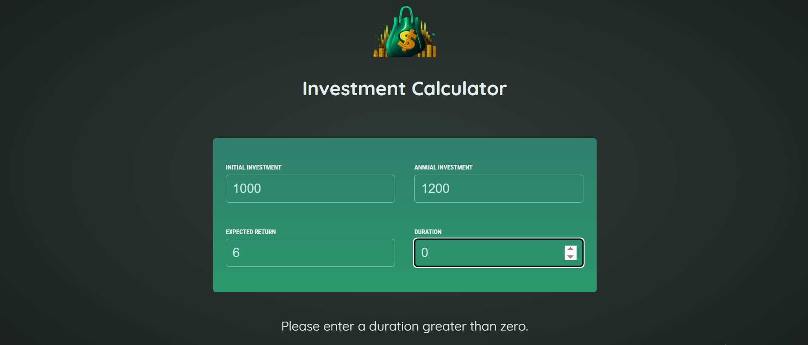
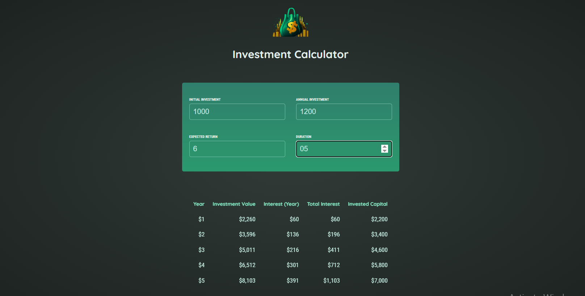

# Investment Calculator 💰

A simple and responsive **Investment Calculator** built with **React**.
The application allows users to enter their investment details and calculates the expected investment growth over time.

## 📸 Preview




## 🚀 Features

* Enter initial investment amount
* Enter annual investment amount
* Enter expected annual return
* Set investment duration
* Calculate investment growth year by year
* Display:

  * Investment value
  * Yearly interest
  * Total interest
  * Invested capital
* Currency formatting using the JavaScript `Intl.NumberFormat` API
* Reusable React components
* Controlled form inputs

## 🛠️ Technologies

* **React**
* **JavaScript (ES6+)**
* **HTML5**
* **CSS3**
* **Vite**
* React `useState`
* JavaScript `Intl.NumberFormat`

## 📂 Project Structure

```text
src/
├── components/
│   ├── Header.jsx
│   ├── InputGroup.jsx
│   ├── InvestmentForm.jsx
│   └── Result.jsx
│
├── util/
│   └── investment.js
│
├── App.jsx
└── main.jsx
```

## 🧩 Components

### `App`

Manages the application's state and handles changes to the investment inputs.

### `Header`

Displays the application logo and title.

### `InvestmentForm`

Contains the investment input fields and passes the required data to the `InputGroup` components.

### `InputGroup`

A reusable component that combines a label and number input.

### `Result`

Displays the calculated investment results in a table.

### `investment.js`

Contains the investment calculation logic and currency formatter.

## 🧮 Investment Calculation

The application calculates the investment growth for each year based on:

* Initial investment
* Annual investment
* Expected annual return
* Investment duration

The yearly interest is calculated using:

```text
Interest = Current Investment Value × (Expected Return / 100)
```

The investment value is then updated by adding the yearly interest and annual investment.

## ▶️ Getting Started

### 1. Clone the repository

```bash
git clone https://github.com/yasmin528/Investment-Calculator.git
```

### 2. Navigate to the project

```bash
cd investment-calculator
```

### 3. Install dependencies

```bash
npm install
```

### 4. Start the development server

```bash
npm run dev
```

The application will be available at the local URL provided by Vite.


```

## 🎯 Learning Goals

This project was built to practice fundamental React concepts, including:

* Managing state with `useState`
* Passing data through props
* Creating reusable components
* Handling form inputs
* Working with controlled components
* Updating object state immutably
* Separating calculation logic from UI components
* Rendering dynamic data with `.map()`

## 🔮 Possible Improvements

Future improvements could include:

* Input validation and error messages
* Improved accessibility
* Reset button
* Different currencies
* Investment growth chart
* More detailed investment breakdown
* Responsive UI improvements

## 📄 License

This project is for learning and educational purposes.
